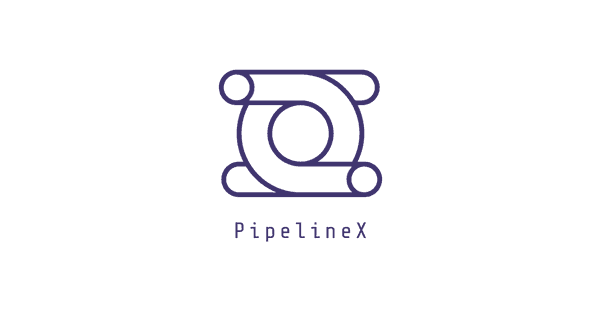
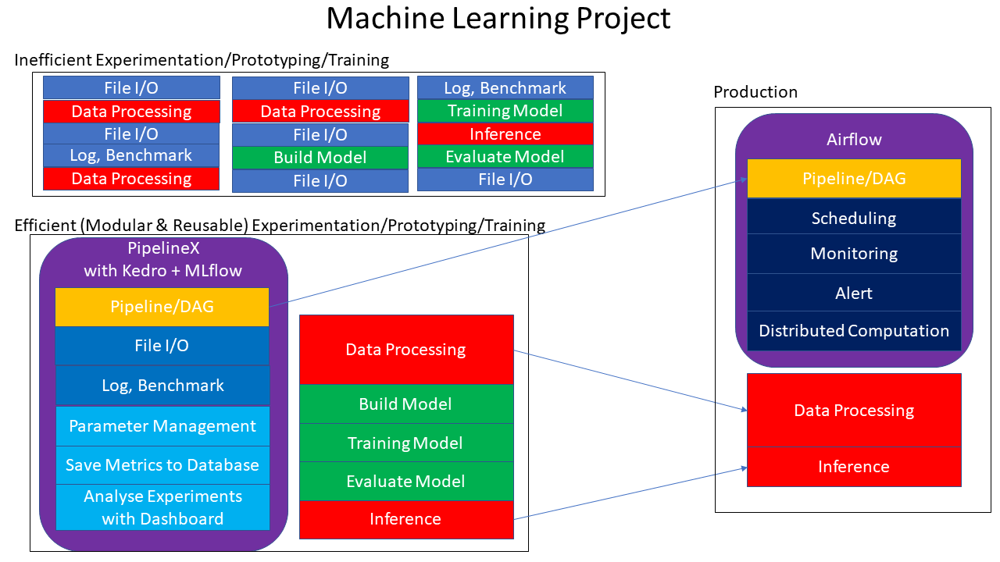

<p align="center">

</p>

# PipelineX

Pipeline for eXperimentation

[](https://badge.fury.io/py/pipelinex)

[](https://github.com/ambv/black)

## Overview

PipelineX is a Python package designed to make Machine Learning projects efficient with modular, reusable, and easy-to-use features for experimentation.

<p align="center">

</p>

Please refer [here](https://github.com/Minyus/Python_Packages_for_Pipeline_Workflow) to find out how PipelineX differs from other pipeline/workflow packages: Airflow, Luigi, Gokart, Metaflow, and Kedro.

PipelineX provides [Pythonic enhanced YAML/JSON](https://github.com/Minyus/pipelinex#pythonic-enhanced-yamljson) support useful for parameter management summarized as follows.

- Import-less Python object: Include (nested) Python classes and functions in a YAML/JSON file
- Anchor-less aliasing: Look up another key in the same YAML/JSON file
- Python expression in YAML/JSON filess

PipelineX provides [YAML-configurable enhanced Kedro](https://github.com/Minyus/pipelinex#yamlconfigurable-enhanced-kedro) support summarized as follows.

- To enhance Kedro-style Pipeline/DAG definition:
  - Option to resume pipeline execution using the intermediate files
  - Pipeline/DAG definition in a YAML/JSON file
  - Optional syntactic sugars (easier grammar) including Sequential API
- In addition Kedro's file I/O and database access abstraction layers:
  - `DataSet` for multiple images in a foldler for image processing applications
- In addition to Kedro's performance benchmarking (time and memory profiling) decorators:
  - GPU memory profiling using NVIDIA Management Library (NVML)
- Integration with MLflow that enables to:
  - Save metrics to a database supported by SQLAlchemy (SQLite, PostgreSQL, etc.)
  - Analyze the experiments with a dashboard

PipelineX includes integration with the following Python packages.

- [Kedro](https://github.com/quantumblacklabs/kedro)
- [MLflow](https://github.com/mlflow/mlflow)
- [PyTorch](https://github.com/pytorch/pytorch)
- [Ignite](https://github.com/pytorch/ignite)
- [Pandas](https://github.com/pandas-dev/pandas)
- [OpenCV](https://github.com/skvark/opencv-python)
- [Memory Profiler](https://github.com/pythonprofilers/memory_profiler)
- [Python bindings to the NVIDIA Management Library](https://github.com/gpuopenanalytics/pynvml)
- [Shap](https://github.com/slundberg/shap)

These wrappers are all independent and optional. You do _not_ need to install all of these Python packages.

PipelineX shares similar philosophy, concepts, or API styles with:

- [Allennlp](https://github.com/allenai/allennlp)
- [Ludwig](https://uber.github.io/ludwig/)
- [Detectron2](https://github.com/facebookresearch/detectron2)
- [Hydra](https://github.com/facebookresearch/hydra)
- [Jsonnet](https://github.com/google/jsonnet)

## Installation

- [Option 1] To install the latest release from the PyPI:

```bash
$ pip install pipelinex
```

- [Option 2] To install the latest pre-release:

```bash
$ pip install git+https://github.com/Minyus/pipelinex.git
```

- [Option 3] To install the latest pre-release without need to reinstall even after modifying the source code:

```bash
$ git clone https://github.com/Minyus/pipelinex.git
$ cd pipelinex
$ python setup.py develop
```

## Why and how PipelineX was born

When I was working on a Deep Learning project, it was very time-consuming to develop the pipeline for experimentation.
I wanted 2 features.

First one was an option to resume the pipeline using the intermediate data files instead of running the whole pipeline.
This was important for rapid Machine/Deep Learning experimentation.

Second one was modularity, which means keeping the 3 components, task processing, file/database access, and DAG definition, independent.
This was important for efficient software engineering.

After this project, I explored for a long-term solution.
I researched about 3 Python packages for pipeline development, Airflow, Luigi, and Kedro, but none of these could be a solution.

Luigi provided resuming feature, but did not offer modularity.
Kedro offered modularity, but did not provide resuming feature.

After this research, I decided to develop my own package that works on top of Kedro.
Besides, I added syntactic sugars including Sequential API similar to Keras and PyTorch to define DAG.
Furthermore, I added integration with MLflow, PyTorch, Ignite, pandas, OpenCV, etc. while working on more Machine/Deep Learning projects.

After I confirmed my package worked well with the Kaggle competition, I released it as PipelineX.

## Example/Demo Projects

- [Computer Vision using PyTorch](https://github.com/Minyus/pipelinex_pytorch)

  - `parameters.yml` at [conf/base/parameters.yml](https://github.com/Minyus/pipelinex_pytorch/blob/master/conf/base/parameters.yml)

  - Packages: PyTorch, Ignite, Shap, Kedro, MLflow
  - Application: Image classification
  - Data: MNIST images
  - Model: CNN (Convolutional Neural Network)
  - Loss: Cross-entropy

- [Kaggle competition using PyTorch](https://github.com/Minyus/kaggle_nfl)

  - `parameters.yml` at [kaggle/conf/base/parameters.yml](https://github.com/Minyus/kaggle_nfl/blob/master/kaggle/conf/base/parameters.yml)

  - Packages: PyTorch, Ignite, pandas, numpy, Kedro, MLflows
  - Application: Kaggle competition to predict the results of American Football plays
  - Data: Sparse heatmap-like field images and tabular data
  - Model: Combination of CNN and MLP
  - Loss: Continuous Rank Probability Score (CRPS)

- [Computer Vision using OpenCV](https://github.com/Minyus/pipelinex_image_processing)

  - `parameters.yml` at [conf/base/parameters.yml](https://github.com/Minyus/pipelinex_image_processing/blob/master/conf/base/parameters.yml)
  - Packages: OpenCV, Scikit-image, numpy, TensorFlow (pretrained model), Kedro, MLflow
  - Application: Image processing to estimate the empty area ratio of cuboid container on a truck
  - Data: container images

- [Uplift Modeling using CausalLift](https://github.com/Minyus/pipelinex_causallift)

  - `parameters.yml` at [conf/base/parameters.yml](https://github.com/Minyus/pipelinex_causallift/blob/master/conf/base/parameters.yml)
  - Packages: CausalLift, Scikit-learn, XGBoost, Kedro, MLflow
  - Application: Uplift Modeling to find which customers should be targeted and which customers should not for a marketing campaign (treatment)
  - Data: generated by simulation

## Template

PipelineX project template is available at:
https://github.com/Minyus/pipelinex_template

## Pythonic enhanced YAML/JSON (`HatchDict`)

[](https://colab.research.google.com/github/Minyus/pipelinex/blob/master/notebooks/HatchDict_demo.ipynb)

### Import-less Python object (class and function)

YAML is a common text format used for application config files.

YAML's most notable advantage is allowing users to mix 2 styles, block style and flow style.

Example:

```python
import yaml
from pprint import pprint  # pretty-print for clearer look

# Read parameters dict from a YAML file in actual use
params_yaml="""
block_style_demo:
  key1: value1
  key2: value2
flow_style_demo: {key1: value1, key2: value2}
"""
parameters = yaml.safe_load(params_yaml)

print("### 2 styles in YAML ###")
pprint(parameters)
```

```
### 2 styles in YAML ###
{'block_style_demo': {'key1': 'value1', 'key2': 'value2'},
 'flow_style_demo': {'key1': 'value1', 'key2': 'value2'}}
```

YAML's block style, which uses indentation, allows users to omit opening and closing symbols to specify a Python dict or list (`{}` or `[]`).

YAML's flow style, which uses opening and closing symbols, allows users to specify a Python dict or list within a single line.

To store highly nested (hierarchical) dict or list, YAML is more conveinient than hard-coding in Python code.

Python packages for Machine Learning provides components (e.g. model, neural network module, optimizer, etc.) as Python objects (classes and functions)

To use a Python object (class or function), in general, you need 2 steps: import and construct/call.

Example:

```python
from sklearn.linear_model import LogisticRegression

model = LogisticRegression(C=1.0, random_state=42, max_iter=100)

print("### model object by hard-coding ###")
print(model)
```

```
### model object by hard-coding ###
LogisticRegression(C=1.0, class_weight=None, dual=False, fit_intercept=True,
                   intercept_scaling=1, l1_ratio=None, max_iter=100,
                   multi_class='warn', n_jobs=None, penalty='l2',
                   random_state=42, solver='warn', tol=0.0001, verbose=0,
                   warm_start=False)
```

To manage experiments, it is a common practice to store parameters in a YAML or JSON file.

Example:

```python
import yaml
from pprint import pprint  # pretty-print for clearer look


# Read parameters dict from a YAML file in actual use
params_yaml = """
model_kind: LogisticRegression
model_params:
  C: 1.23456
  max_iter: 987
  random_state: 42
"""
parameters = yaml.safe_load(params_yaml)

print("### Before ###")
pprint(parameters)

model_kind = parameters.get("model_kind")
model_params_dict = parameters.get("model_params")

if model_kind == "LogisticRegression":
    from sklearn.linear_model import LogisticRegression
    model = LogisticRegression(**model_params_dict)

elif model_kind == "DecisionTree":
    from sklearn.tree import DecisionTreeClassifier
    model = DecisionTreeClassifier(**model_params_dict)

elif model_kind == "RandomForest":
    from sklearn.ensemble import RandomForestClassifier
    model = RandomForestClassifier(**model_params_dict)

else:
    raise ValueError("Unsupported model_kind.")

print("\n### After ###")
print(model)
```

```
### Before ###
{'model_kind': 'LogisticRegression',
 'model_params': {'C': 1.23456, 'max_iter': 987, 'random_state': 42}}

### After ###
LogisticRegression(C=1.23456, class_weight=None, dual=False, fit_intercept=True,
                   intercept_scaling=1, l1_ratio=None, max_iter=987,
                   multi_class='warn', n_jobs=None, penalty='l2',
                   random_state=42, solver='warn', tol=0.0001, verbose=0,
                   warm_start=False)
```

This way, however, is inefficient as you need to add `import` and `if` statements for the options in the Python code in addition to modifying the YAML/JSON config file.

PyYAML provides [UnsafeLoader](<https://github.com/yaml/pyyaml/wiki/PyYAML-yaml.load(input)-Deprecation>) which can load Python objects without `import`.

```python
import yaml
# You do not need `import sklearn.linear_model` using PyYAML's UnsafeLoader


# Read parameters dict from a YAML file in actual use
params_yaml = """
model:
  !!python/object:sklearn.linear_model.LogisticRegression
  C: 1.23456
  max_iter: 987
  random_state: 42
"""

parameters = yaml.unsafe_load(params_yaml)  # unsafe_load required

model = parameters.get("model")

print("### model object by PyYAML's UnsafeLoader ###")
print(model)
```

```
### model object by PyYAML's UnsafeLoader ###
LogisticRegression(C=1.23456, class_weight=None, dual=None, fit_intercept=None,
                   intercept_scaling=None, l1_ratio=None, max_iter=987,
                   multi_class=None, n_jobs=None, penalty=None, random_state=42,
                   solver=None, tol=None, verbose=None, warm_start=None)
```

[PyYAML's `!!python/object` and `!!python/name`](https://pyyaml.org/wiki/PyYAMLDocumentation), however, has the following problems.

- `!!python/object` or `!!python/name` are too long to write.
- Positional (non-keyword) arguments are apparently not supported.

PipelineX's HatchDict is the solution.

PipelineX's HatchDict provides an easier syntax, as follows, to convert Python dictionaries read from YAML or JSON files to Python objects without `import`.

- Use `=` key to specify the package, module, and class/function with `.` separator in `foo_package.bar_module.baz_class` format.
- [Optional] Use `_` key to specify (list of) positional arguments (args) if any.
- [Optional] Add keyword arguments (kwargs) if any.

To return an object instance like PyYAML's `!!python/object`, feed positional and/or keyword arguments. If there is no arguments, just feed null (known as `None` in Python) to `_` key.

To return an uninstantiated (raw) object like PyYAML's `!!python/name`, just feed `=` key without positional nor keyword arugments.

Example:

```python
from pipelinex import HatchDict
import yaml
from pprint import pprint  # pretty-print for clearer look
# You do not need `import sklearn.linear_model` using PipelineX's HatchDict

# Read parameters dict from a YAML file in actual use
params_yaml="""
model:
  =: sklearn.linear_model.LogisticRegression
  C: 1.23456
  max_iter: 987
  random_state: 42
"""
parameters = yaml.safe_load(params_yaml)

model_dict = parameters.get("model")

print("### Before ###")
pprint(model_dict)

model = HatchDict(parameters).get("model")

print("\n### After ###")
print(model)
```

```
### Before ###
{'=': 'sklearn.linear_model.LogisticRegression',
 'C': 1.23456,
 'max_iter': 987,
 'random_state': 42}

### After ###
LogisticRegression(C=1.23456, class_weight=None, dual=False, fit_intercept=True,
                   intercept_scaling=1, l1_ratio=None, max_iter=987,
                   multi_class='warn', n_jobs=None, penalty='l2',
                   random_state=42, solver='warn', tol=0.0001, verbose=0,
                   warm_start=False)
```

This import-less Python object supports nested objects (objects that receives object arguments) by recursive depth-first search.

For more examples, please see [Use with PyTorch](https://github.com/Minyus/pipelinex#use-with-pytorch) and `parameters.yml` in [example/demo projects](https://github.com/Minyus/pipelinex#exampledemo-projects) .

This import-less Python object feature, inspired by the fact that Kedro uses `load_obj` for file I/O (`DataSet`), uses `load_obj` copied from [kedro.utils](https://github.com/quantumblacklabs/kedro/blob/0.15.4/kedro/utils.py) which dynamically imports Python objects using [`importlib`](https://docs.python.org/3.6/library/importlib.html), a Python standard library.

### Anchor-less aliasing (self-lookup)

To avoid repeating, YAML natively provides Anchor&Alias [Anchor&Alias](https://confluence.atlassian.com/bitbucket/yaml-anchors-960154027.html) feature, and [Jsonnet](https://github.com/google/jsonnet) provides [Variable](https://github.com/google/jsonnet/blob/master/examples/variables.jsonnet) feature to JSON.

Example:

```python
import yaml
from pprint import pprint  # pretty-print for clearer look

# Read parameters dict from a YAML file in actual use
params_yaml="""
train_params:
  train_batch_size: &batch_size 32
  val_batch_size: *batch_size
"""
parameters = yaml.safe_load(params_yaml)

train_params_dict = parameters.get("train_params")

print("### Conversion by YAML's Anchor&Alias feature ###")
pprint(train_params_dict)
```

```
### Conversion by YAML's Anchor&Alias feature ###
{'train_batch_size': 32, 'val_batch_size': 32}
```

Unfortunately, YAML and Jsonnet require a medium to share the same value.

This is why PipelineX provides Anchor-less aliasing feature.

You can directly look up another value in the same YAML/JSON file using `$` key without an anchor nor variable.

To specify the nested key (key in a dict of dict), use `.` as the separator.

Example:

```python
from pipelinex import HatchDict
import yaml
from pprint import pprint  # pretty-print for clearer look

# Read parameters dict from a YAML file in actual use
params_yaml="""
train_params:
  train_batch_size: 32
  val_batch_size: {$: train_params.train_batch_size}
"""
parameters = yaml.safe_load(params_yaml)

train_params_dict = parameters.get("train_params")

print("### Before ###")
pprint(train_params_dict)

train_params = HatchDict(parameters).get("train_params")

print("\n### After ###")
pprint(train_params)
```

```
### Before ###
{'train_batch_size': 32,
 'val_batch_size': {'$': 'train_params.train_batch_size'}}

### After ###
{'train_batch_size': 32, 'val_batch_size': 32}
```

### Python expression

Strings wrapped in parentheses are evaluated as a Python expression.

```python
from pipelinex import HatchDict
import yaml
from pprint import pprint  # pretty-print for clearer look

# Read parameters dict from a YAML file in actual use
params_yaml = """
train_params:
  param1_tuple_python: (1, 2, 3)
  param1_tuple_yaml: !!python/tuple [1, 2, 3]
  param2_formula_python: (2 + 3)
  param3_neg_inf_python: (float("-Inf"))
  param3_neg_inf_yaml: -.Inf
  param4_float_1e9_python: (1e9)
  param4_float_1e9_yaml: 1.0e+09
  param5_int_1e9_python: (int(1e9))
"""
parameters = yaml.load(params_yaml)

train_params_raw = parameters.get("train_params")

print("### Before ###")
pprint(train_params_raw)

train_params_converted = HatchDict(parameters).get("train_params")

print("\n### After ###")
pprint(train_params_converted)
```

```
### Before ###
{'param1_tuple_python': '(1, 2, 3)',
 'param1_tuple_yaml': (1, 2, 3),
 'param2_formula_python': '(2 + 3)',
 'param3_neg_inf_python': '(float("-Inf"))',
 'param3_neg_inf_yaml': -inf,
 'param4_float_1e9_python': '(1e9)',
 'param4_float_1e9_yaml': 1000000000.0,
 'param5_int_1e9_python': '(int(1e9))'}

### After ###
{'param1_tuple_python': (1, 2, 3),
 'param1_tuple_yaml': (1, 2, 3),
 'param2_formula_python': 5,
 'param3_neg_inf_python': -inf,
 'param3_neg_inf_yaml': -inf,
 'param4_float_1e9_python': 1000000000.0,
 'param4_float_1e9_yaml': 1000000000.0,
 'param5_int_1e9_python': 1000000000}
```

## YAML-configurable enhanced Kedro

Kedro is a Python package to develop pipelines consisting of tasks (called `node`).

Regarding Kedro, please see the [Kedro's document](https://kedro.readthedocs.io/en/latest/)
and comparison with other pipeline/workflow packages [here](https://github.com/Minyus/Python_Packages_for_Pipeline_Workflow).

Example Kedro run code (modified and simplified version of [kedro-tutorial's run.py](https://github.com/quantumblacklabs/kedro-examples/blob/master/kedro-tutorial/src/kedro_tutorial/run.py)):

```python
from typing import Dict

from kedro.context import KedroContext
from kedro.pipeline import Pipeline

from kedro_tutorial.pipeline import create_pipelines


class ProjectContext(KedroContext):
    """Users can override the remaining methods from the parent class here,
    or create new ones (e.g. as required by plugins)
    """

    project_name = "kedro-tutorial"
    project_version = "0.15.9"

    def _get_pipelines(self) -> Dict[str, Pipeline]:
        return create_pipelines()


context = ProjectContext()
context.run(pipeline_name="__default__", runner=SequentialRunner())
```

Example Kedro Pipeline:

```python
from kedro.pipeline import Pipeline, node

from my_module import processing_task_1, processing_task_2, processing_task_3

def create_pipeline(**kwargs):
    return Pipeline(
        [
            node(
                func=processing_task_1,
                inputs="input_data_1",
                outputs=["intermediate_data_1", "intermediate_data_2"],
            ),
            node(
                func=processing_task_2,
                inputs="intermediate_data_1",
                outputs="trivial_intermediate_data",
            ),
            node(
                func=processing_task_3,
                inputs="trivial_intermediate_data",
                outputs="output_data",
            ),
        ]
    )
```

Example Kedro Catalog:

```yaml
#  catalog.yml

input_data_1:
  type: CSVLocalDataSet
  filepath: data/input/input_data_1.csv

intermediate_data_1:
  type: PickleLocalDataSet
  filepath: data/load/intermediate_data_1.pickle

intermediate_data_2:
  type: CSVLocalDataSet
  filepath: data/load/intermediate_data_2.csv

output_data:
  type: CSVLocalDataSet
  filepath: data/load/output_data.csv
```

PipelineX enables you to use Kedro in more convenient ways:

- Configure Kedro run config in `parameters.yml` using `RUN_CONFIG` key
  - Optionally run only missing nodes (skip tasks which have already been run to resume pipeline using the intermediate data files or databases.)
  - Optionally run nodes in parallel
- Define Kedro pipeline in `parameters.yml` using `PIPELINES` key
  - Optionally specify the default Python module (path of .py file) if you want to omit the module name
  - Optionally specify the Python function decorator to apply to each node
  - Specify `inputs`, `func`, and `outputs` for each node
    - For sub-pipelines consisting of nodes of only single input and single output, you can optionally use Sequential API similar to PyTorch (`torch.nn.Sequential`) and Keras (`tf.keras.Sequential`)
- Integration with MLflow
  - Optionally specify the MLflow tracking database URI
    (For more details, see [SQLAlchemy database uri](https://docs.sqlalchemy.org/en/13/core/engines.html#database-urls))
  - Optionally specify the experiment name
  - Optionally specify the location to save artifacts
  - Optionally specify the offset hour (local time zone) to show in MLflow log (e.g. 0 for UK, 8 for Singapore)
  - Optionally specify the artifacts (e.g. parameters, trained model, prediction) to save
- Syntactic sugar for `catalog.yml`
  - Optionally specify the `filepath` as the catalog entry name so the file name without extension is used as the DataSet instance name
  - Optionally specify the artifact (file) to log to MLflow's directory using `mlflow_logging` key (`mlflow.log_artifact` function is used under the hood.)
  - Optionally enable caching using `cached` key set to True if you do not want Kedro to load the data from disk/database which were in the memory. ([`kedro.io.CachedDataSet`](https://kedro.readthedocs.io/en/latest/kedro.io.CachedDataSet.html#kedro.io.CachedDataSet) is used under the hood.)
  - Optionally specify the default `DataSet` and its parameters using `/` key so you can reduce copying.

```yaml
# parameters.yml

RUN_CONFIG:
  pipeline_name: __default__
  only_missing: False # Set True to run only missing nodes
  runner: SequentialRunner # Set to "ParallelRunner" to run in parallel

PIPELINES:
  __default__:
    =: pipelinex.FlexiblePipeline
    module: # Optionally specify the default Python module so you can omit the module name to which functions belongs
    decorator: # Optionally specify function decorator(s) to apply to each node
    nodes:
      - inputs: input_data_1
        func: my_module.processing_task_1
        outputs: [intermediate_data_1, intermediate_data_2]

      - inputs: intermediate_data_1
        func:
          - my_module.processing_task_2
          - my_module.processing_task_3
        outputs: output_data

MLFLOW_LOGGING_CONFIG:
  uri: sqlite:///mlruns/sqlite.db
  experiment_name: experiment_001
  artifact_location: ./mlruns/experiment_001
  offset_hours: 0 # Specify the offset hour (local time zone) to show in MLflow tracking
  logging_artifacts: # Optionally specify artifacts (e.g. parameters, trained model, prediction) to save
```

```yaml
#  catalog.yml

/: # Optionally specify the default DataSet
  type: CSVLocalDataSet
  cached: True

data/input/input_data_1.csv: # Use the default DataSet

data/load/intermediate_data_1.pickle:
  type: PickleLocalDataSet

data/load/intermediate_data_2.csv: # Use the default DataSet

data/load/output_data.csv: # Use the default DataSet
  mlflow_logging: True
```

## Decorator-based benchmarking

[](https://colab.research.google.com/github/Minyus/pipelinex/blob/master/notebooks/decorators_demo.ipynb)

PipelineX provides Python decorators for benchmarking.

- `log_time` logs the difference of timestamp before and after running the function.

  - Slightly modified version of [Kedro's log_time](https://github.com/quantumblacklabs/kedro/blob/develop/kedro/pipeline/decorators.py#L59)

- `mem_profile` logs the peak memory usage during running the function.

  - `memory_profiler` needs to be installed.
  - Slightly modified version of [Kedro's mem_profile](https://github.com/quantumblacklabs/kedro/blob/develop/kedro/extras/decorators/memory_profiler.py#L48)

- `nvml_profile` logs the difference of NVIDIA GPU usage before and after running the function.
  - `pynvml` or `py3nvml` needs to be installed.

```python
from pipelinex import log_time
from pipelinex import mem_profile  # Need to install memory_profiler for memory profiling
from pipelinex import nvml_profile  # Need to install pynvml for NVIDIA GPU profiling
from time import sleep
import logging

logging.basicConfig(level=logging.INFO)

@nvml_profile
@mem_profile
@log_time
def foo_func(i=1):
    sleep(0.5)  # Needed to avoid the bug reported at https://github.com/pythonprofilers/memory_profiler/issues/216
    return "a" * i

output = foo_func(100_000_000)
```

```
INFO:pipelinex.decorators.decorators:Running 'foo_func' took 549ms [0.549s]
INFO:pipelinex.decorators.memory_profiler:Running 'foo_func' consumed 579.02MiB memory at peak time
INFO:pipelinex.decorators.nvml_profiler:Ran: 'foo_func', NVML returned: {'_Driver_Version': '418.67', '_NVML_Version': '10.418.67', 'Device_Count': 1, 'Devices': [{'_Name': 'Tesla P100-PCIE-16GB', 'Total_Memory': 17071734784, 'Free_Memory': 17071669248, 'Used_Memory': 65536, 'GPU_Utilization_Rate': 0, 'Memory_Utilization_Rate': 0}]}, Used memory diff: [0]
```

These decorators can be set up for each or every task in the Kedro pipeline in `parameters.yml` taking advantage of the import-less Python object feature.

## Use with PyTorch

[](https://colab.research.google.com/github/Minyus/pipelinex/blob/master/notebooks/PyTorch_demo.ipynb)

To develop a simple neural network, it is convenient to use Sequential API
(e.g. `torch.nn.Sequential`, `tf.keras.Sequential`).

- Hardcoded:

```python
from torch.nn import Sequential, Conv2d, ReLU

model = Sequential(
    Conv2d(in_channels=3, out_channels=16, kernel_size=[3, 3]),
    ReLU(),
)

print("### model object by hard-coding ###")
print(model)
```

```
### model object by hard-coding ###
Sequential(
  (0): Conv2d(3, 16, kernel_size=[3, 3], stride=(1, 1))
  (1): ReLU()
)
```

- Using import-less Python object feature:

```python
from pipelinex import HatchDict
import yaml
from pprint import pprint  # pretty-print for clearer look

# Read parameters dict from a YAML file in actual use
params_yaml="""
model:
  =: torch.nn.Sequential
  _:
    - {=: torch.nn.Conv2d, in_channels: 3, out_channels: 16, kernel_size: [3, 3]}
    - {=: torch.nn.ReLU, _: }
"""
parameters = yaml.safe_load(params_yaml)

model_dict = parameters.get("model")

print("### Before ###")
pprint(model_dict)

model = HatchDict(parameters).get("model")

print("\n### After ###")
print(model)
```

```
### Before ###
{'=': 'torch.nn.Sequential',
 '_': [{'=': 'torch.nn.Conv2d',
        'in_channels': 3,
        'kernel_size': [3, 3],
        'out_channels': 16},
       {'=': 'torch.nn.ReLU', '_': None}]}

### After ###
Sequential(
  (0): Conv2d(3, 16, kernel_size=[3, 3], stride=(1, 1))
  (1): ReLU()
)
```

In addition to `Sequential`, TensorFLow/Keras provides modules to merge branches such as
`tf.keras.layers.Concatenate`, but PyTorch provides only functional interface such as `torch.cat`.

PipelineX provides modules to merge branches such as `ModuleConcat`, `ModuleSum`, and `ModuleAvg`.

- Hardcoded:

```python
from torch.nn import Sequential, Conv2d, AvgPool2d, ReLU
from pipelinex import ModuleConcat

model = Sequential(
    ModuleConcat(
        Conv2d(in_channels=3, out_channels=16, kernel_size=[3, 3], stride=[2, 2], padding=[1, 1]),
        AvgPool2d(kernel_size=[3, 3], stride=[2, 2], padding=[1, 1]),
    ),
    ReLU(),
)
print("### model object by hard-coding ###")
print(model)
```

```
### model object by hard-coding ###
Sequential(
  (0): ModuleConcat(
    (0): Conv2d(3, 16, kernel_size=[3, 3], stride=[2, 2], padding=[1, 1])
    (1): AvgPool2d(kernel_size=[3, 3], stride=[2, 2], padding=[1, 1])
  )
  (1): ReLU()
)
```

- Using import-less Python object feature:

```python
from pipelinex import HatchDict
import yaml
from pprint import pprint  # pretty-print for clearer look

# Read parameters dict from a YAML file in actual use
params_yaml="""
model:
  =: torch.nn.Sequential
  _:
    - =: pipelinex.ModuleConcat
      _:
        - {=: torch.nn.Conv2d, in_channels: 3, out_channels: 16, kernel_size: [3, 3], stride: [2, 2], padding: [1, 1]}
        - {=: torch.nn.AvgPool2d, kernel_size: [3, 3], stride: [2, 2], padding: [1, 1]}
    - {=: torch.nn.ReLU, _: }
"""
parameters = yaml.safe_load(params_yaml)

model_dict = parameters.get("model")

print("### Before ###")
pprint(model_dict)

model = HatchDict(parameters).get("model")

print("\n### After ###")
print(model)
```

```
### Before ###
{'=': 'torch.nn.Sequential',
 '_': [{'=': 'pipelinex.ModuleConcat',
        '_': [{'=': 'torch.nn.Conv2d',
               'in_channels': 3,
               'kernel_size': [3, 3],
               'out_channels': 16,
               'padding': [1, 1],
               'stride': [2, 2]},
              {'=': 'torch.nn.AvgPool2d',
               'kernel_size': [3, 3],
               'padding': [1, 1],
               'stride': [2, 2]}]},
       {'=': 'torch.nn.ReLU', '_': None}]}

### After ###
Sequential(
  (0): ModuleConcat(
    (0): Conv2d(3, 16, kernel_size=[3, 3], stride=[2, 2], padding=[1, 1])
    (1): AvgPool2d(kernel_size=[3, 3], stride=[2, 2], padding=[1, 1])
  )
  (1): ReLU()
)
```

## Use with PyTorch Ignite

Wrappers of PyTorch Ignite provides most of features available in Ignite, including integration with MLflow, in an easy declarative way.

In addition, the following optional features are available in PipelineX.

- Use only partial samples in dataset (Useful for quick preliminary check before using the whole dataset)
- Time limit for training (Useful for code-only (Kernel-only) Kaggle competitions with time limit)

Here are the arguments for [`NetworkTrain`](https://github.com/Minyus/pipelinex/blob/master/src/pipelinex/ops/ignite/declaratives/declarative_trainer.py):

```
loss_fn (callable): Loss function used to train.
    Accepts an instance of loss functions at https://pytorch.org/docs/stable/nn.html#loss-functions
epochs (int, optional): Max epochs to train
seed (int, optional): Random seed for training.
optimizer (torch.optim, optional): Optimizer used to train.
    Accepts optimizers at https://pytorch.org/docs/stable/optim.html
optimizer_params (dict, optional): Parameters for optimizer.
train_data_loader_params (dict, optional): Parameters for data loader for training.
    Accepts args at https://pytorch.org/docs/stable/data.html#torch.utils.data.DataLoader
val_data_loader_params (dict, optional): Parameters for data loader for validation.
    Accepts args at https://pytorch.org/docs/stable/data.html#torch.utils.data.DataLoader
evaluation_metrics (dict, optional): Metrics to compute for evaluation.
    Accepts dict of metrics at https://pytorch.org/ignite/metrics.html
evaluate_train_data (str, optional): When to compute evaluation_metrics using training dataset.
    Accepts events at https://pytorch.org/ignite/engine.html#ignite.engine.Events
evaluate_val_data (str, optional): When to compute evaluation_metrics using validation dataset.
    Accepts events at https://pytorch.org/ignite/engine.html#ignite.engine.Events
progress_update (bool, optional): Whether to show progress bar using tqdm package
scheduler (ignite.contrib.handle.param_scheduler.ParamScheduler, optional): Param scheduler.
    Accepts a ParamScheduler at
    https://pytorch.org/ignite/contrib/handlers.html#module-ignite.contrib.handlers.param_scheduler
scheduler_params (dict, optional): Parameters for scheduler
model_checkpoint (ignite.handlers.ModelCheckpoint, optional): Model Checkpoint.
    Accepts a ModelCheckpoint at https://pytorch.org/ignite/handlers.html#ignite.handlers.ModelCheckpoint
model_checkpoint_params (dict, optional): Parameters for ModelCheckpoint at
    https://pytorch.org/ignite/handlers.html#ignite.handlers.ModelCheckpoint
early_stopping_params (dict, optional): Parameters for EarlyStopping at
    https://pytorch.org/ignite/handlers.html#ignite.handlers.EarlyStopping
time_limit (int, optioinal): Time limit for training in seconds.
train_dataset_size_limit (int, optional): If specified, only the subset of training dataset is used.
    Useful for quick preliminary check before using the whole dataset.
val_dataset_size_limit (int, optional): If specified, only the subset of validation dataset is used.
    useful for qucik preliminary check before using the whole dataset.
cudnn_deterministic (bool, optional): Value for torch.backends.cudnn.deterministic.
    See https://pytorch.org/docs/stable/notes/randomness.html for details.
cudnn_benchmark (bool, optional): Value for torch.backends.cudnn.benchmark.
    See https://pytorch.org/docs/stable/notes/randomness.html for details.
mlflow_logging (bool, optional): If True and MLflow is installed, MLflow logging is enabled.
```

Please see the [example code using MNIST dataset](https://github.com/Minyus/pipelinex/blob/master/examples/mnist/mnist_with_declarative_trainer.py) prepared based on the [original code](https://github.com/pytorch/ignite/blob/master/examples/mnist/mnist.py).

It is also possible to use:

- [FlexibleModelCheckpoint](https://github.com/Minyus/pipelinex/blob/master/src/pipelinex/ops/ignite/handlers/flexible_checkpoint.py) handler which enables to use timestamp in the model checkpoint file name to clarify which one is the latest.
- [CohenKappaScore](https://github.com/Minyus/pipelinex/blob/master/src/pipelinex/ops/ignite/metrics/cohen_kappa_score.py) metric which can compute Quadratic Weighted Kappa Metric used in some Kaggle competitions. See [sklearn.metrics.cohen_kappa_score](https://scikit-learn.org/stable/modules/generated/sklearn.metrics.cohen_kappa_score.html) for details.

It is planned to port some [code used with PyTorch Ignite](https://github.com/Minyus/pipelinex/tree/master/src/pipelinex/ops/ignite) to [PyTorch Ignite](https://github.com/pytorch/ignite) repository once test and example codes are prepared.

## Use with OpenCV

A challenge of image processing is that the parameters and algorithms that work with an image often do not work with another image. You will want to output intermediate images from each image processing pipeline step for visual check during development, but you will not want to output all the intermediate images to save time and disk space in production.

Wrappers of OpenCV and `ImagesLocalDataSet` are the solution. You can concentrate on developping your image processing pipeline for an image (3-D or 2-D numpy array), and it will run for all the images in a folder.

If you are devepping an image processing pipeline consisting of 5 steps and you have 10 images, for example, you can check 10 generated images in each of 5 folders, 50 images in total, during development.

## Use with PyTorch Lightning

(To-do)

## Use with TensorFlow/Keras

(To Do.)

## Use with Docker container

### Build Docker image

```bash
# docker build -t pipelinex:3.7.7-slim -f dockerfiles/dockerfile .
```

### Use with Docker container

```bash
# docker run -it --name pipelinex pipelinex:3.7.7-slim /bin/bash
```

## Contributors wanted!

Please see [CONTRIBUTING.md](https://github.com/Minyus/pipelinex/blob/master/CONTRIBUTING.md) for details.

## Author

Yusuke Minami

- [GitHub](https://github.com/Minyus)
- [Linkedin](https://www.linkedin.com/in/yusukeminami/)
- [Twitter](https://twitter.com/Minyus86)

## Contributors

- [shibuiwilliam](https://github.com/shibuiwilliam)
